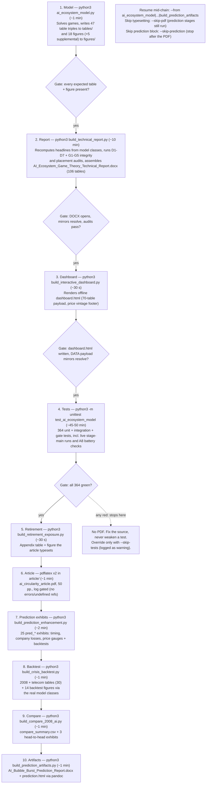
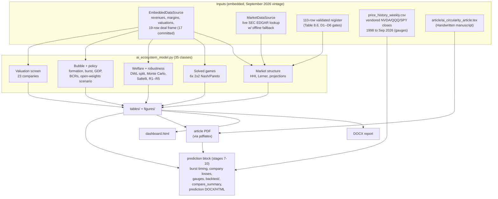
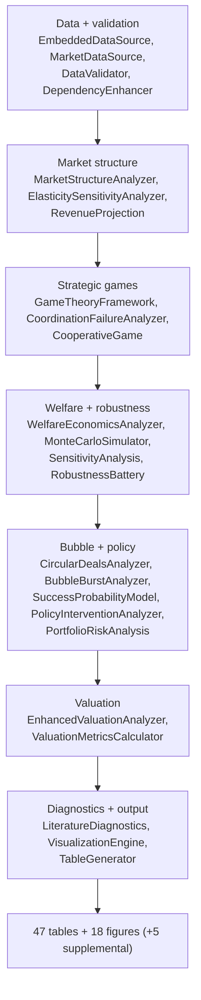
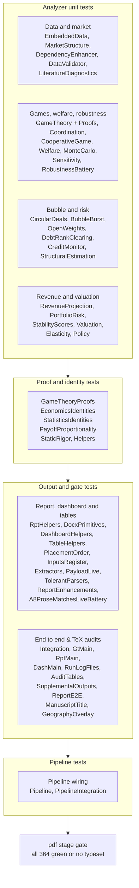

# AI Ecosystem Game Theory — Computational Pipeline

[](https://www.python.org/)
[](#tests-and-coverage)
[](#tests-and-coverage)

*Licensed under [CC BY-NC-ND 4.0](https://creativecommons.org/licenses/by-nc-nd/4.0/) — see [LICENSE](LICENSE).*

Models the AI industry as a four-archetype game (Hardware, Cloud Providers,
Foundation Models, LLM Wrappers) bound by 17 committed circular-financing edges ($675.40B; 19 rows tracked
including a $500B prospective facility and a $12.93B vertical-integration
acquisition that are disclosed, not booked), solves the six pairwise games, and carries the solution
through welfare accounting, bubble diagnostics, burst-incidence ranking,
GDP-at-risk, a 23-company valuation screen, and priced policy interventions.
A prediction addendum dates the burst (first-tip system median Q2'29), splits
burst losses across all 23 screened companies on market-cap and deal-flow
bases (NVIDIA midpoint $198.3B), and triangulates both with price-based
convexity and crash-hazard gauges backtested on 2008, 2000, and the quiet
February 2025 control (crash-week capture 41.3%, 2.06x lift over baseline).
Every number in the paper ([`article/ai_circularity_article.pdf`](article/ai_circularity_article.pdf)),
the technical report, and the dashboard is produced by this pipeline.

## Table of contents

- [Quickstart](#quickstart)
- [Pipeline stages](#pipeline-stages)
- [Data flow](#data-flow)
- [Repository layout](#repository-layout)
- [Module map](#module-map-ai_ecosystem_modelpy)
- [Outputs inventory](#outputs-inventory)
- [Reproducibility](#reproducibility)
- [Open-weights scenario](#open-weights-scenario-chinese-model-channel)
- [Tests and coverage](#tests-and-coverage)
- [CLI reference](#cli-reference)
- [Scope and limits](#scope-and-limits)
- [Troubleshooting](#troubleshooting)
- [FAQ](#faq)
- [Citing this work](#citing-this-work)
- [Contributing](#contributing)

## Quickstart

```bash
git clone https://github.com/ranjithvijik/airesearch
cd airesearch
python3 -m venv .venv && source .venv/bin/activate   # optional but recommended
pip install numpy pandas matplotlib seaborn networkx scipy openpyxl python-docx Pillow beautifulsoup4
python3 run_pipeline.py                 # full chain (see below, ~60-70 min)
```

> ⚠️ **Prerequisite Note on LaTeX Source (`article/`):**  
> `article/ai_circularity_article.tex` is the **handwritten source manuscript** and an essential input to the pipeline. Its prose is handwritten, but its Table 8.7 values are **not**: the `ai_ecosystem_model` stage renders them from live output into `article/generated_a8_intervals.tex`, which the manuscript `\input`'s (never retype those intervals by hand). Ensure `article/ai_circularity_article.tex` is present in the `article/` directory before running `run_pipeline.py` or `python3 -m unittest test_ai_ecosystem_model` (the test suite audits its prose and structure for live consistency, and the `pdf` stage compiles it into `article/ai_circularity_article.pdf`). Auxiliary typesetting files (`.aux`, `.toc`, `.out`, `.log`) are created automatically by `pdflatex`.

Consolidated package need per file (direct + transitive imports, verified
against each file's import statements):

| File | Must be installed | Notes |
|------|-------------------|-------|
| `ai_ecosystem_model.py` | numpy, pandas, matplotlib, seaborn, networkx, scipy | openpyxl optional (`.xlsx` skipped without it, CSV/LaTeX still land); IPython optional, import-guarded |
| `build_technical_report.py` | all model deps above, plus python-docx, Pillow | imports `ai_ecosystem_model`, so the model deps ride along |
| `build_interactive_dashboard.py` | all model deps above, plus python-docx | matplotlib + docx used lazily (games payload, report parsing); the emitted `dashboard.html` runs fully offline with no dependencies |
| `test_ai_ecosystem_model.py` | everything above, plus openpyxl | imports the model plus all seven stage modules; audits `article/ai_circularity_article.tex`; `coverage` needed only for the coverage-report command |
| `build_prediction_enhancement.py` | numpy, pandas, matplotlib | regenerates 25 `pred_*` figures from `tables/` (no model import) |
| `build_retirement_exposure.py` | numpy, pandas, matplotlib | reads `tables/table_7.12_gdp_impact.csv` + sourced constants; writes `tables/backtest/retirement_exposure.*` + figure |
| `build_crisis_backtest.py` | all model deps above | imports `ai_ecosystem_model`, so the model deps ride along |
| `build_compare_2008_ai.py` | numpy, pandas, matplotlib | reads backtest/model tables, writes `compare_summary` + exhibits |
| `build_prediction_artifacts.py` | python-docx, beautifulsoup4, **pandoc ≥ 3** (binary) | converts `article/ai_circularity_article.tex` to DOCX/HTML; stdlib otherwise |
| `run_pipeline.py` | stdlib only | shells out to the stage scripts, so a full run needs the union of the rows above |

The PDF stage needs a LaTeX distribution providing `pdflatex`.
Requires **Python 3.7+**; the orchestrator (`run_pipeline.py`) itself uses
only the standard library, so it never blocks on a missing dependency before
telling you which stage needs what.

> **Price history note:** `tables/price_history_weekly.csv` (NVDA/QQQ/SPY
> weekly closes, 1998 → Sep 2026, split/dividend-adjusted) is vendored
> input for the convexity and hazard gauges — fetch it once with `yfinance`
> if you ever refresh the vintage; no stage downloads market data at build
> time, so `yfinance` is procurement-only and never a runtime dependency.

> **Tip:** if you only want the numeric results (tables/figures) without the
> DOCX report, dashboard, tests, or PDF, call `python3 ai_ecosystem_model.py`
> directly. `run_pipeline.py --skip-pdf` still runs every other stage and
> only skips typesetting.

## Pipeline stages

`run_pipeline.py` drives ten stages in order, failing fast with the missing
artifact named. The test suite runs **before** typesetting on purpose — a red
suite means the outputs are unverified, and no PDF is built from them.



| # | Stage | Command | Observed duration | Verified artifact |
|---|-------|---------|-------------------|-------------------|
| 1 | Model | `python3 ai_ecosystem_model.py` | ~1 min | `tables/` (47 CSV/TeX/XLSX triples + `tables_index.csv`), `figures/` (18 PNG+PDF + 5 supplemental pairs) |
| 2 | Report | `python3 build_technical_report.py` | ~10 min | `AI_Ecosystem_Game_Theory_Technical_Report.docx` — narrative + 106 tables; D1–D7 and G1–G5 integrity/placement audits must pass |
| 3 | Dashboard | `python3 build_interactive_dashboard.py` | ~30 s | `dashboard.html` — single-file offline browser (KPIs, Pipeline Tour, report sections, solvable games, sortable tables) |
| 4 | Tests | `python3 -m unittest test_ai_ecosystem_model -v` | ~45–50 min | 364 tests, all green. Gates, mirrors, live-vs-prose battery (A8 + burst-timing + company-loss + gauge + quant-memo + ML horse-race pins), `article/` TeX audits, pipeline wiring, and live stage-main runs (enhancement, retirement, backtest, compare, artifacts) |
| 5 | Retirement exposure | `python3 build_retirement_exposure.py` | ~30 s | `tables/backtest/retirement_exposure.csv` + `figures/retirement_exposure.png`: sourced 401(k)/pension exposure floor (~$2.9T Big Tech slice) and heterogeneous-MPC wealth-channel memo ($6.1–7.0B vs $19.1B uniform) read live from Table 7.12; appendix section, gated before the PDF |
| 6 | Article | `pdflatex` × 2 in `article/` | ~1 min | `ai_circularity_article.pdf`, 50 pp. (TeX log must show no errors / no undefined references) |
| 7 | Prediction exhibits | `python3 build_prediction_enhancement.py` | ~2 min | 25 `pred_*` exhibits regenerated from model tables (label de-collision asserted): burst-timing window, 23-company losses, convexity/hazard gauges + backtests, quant-memo expected losses + timing rationale, ML horse-race evaluation, price-history input |
| 8 | Backtest | `python3 build_crisis_backtest.py` | ~1 min | `tables/backtest/` (30 backtest tables incl. both verdict ledgers; the retirement stage's exposure table lives alongside) + 14 figures via the real model classes: 8 `backtest_*` (2008, incl. Saltelli) + `payoff_matrices_2008` + `payoff_matrices_telecom` (six payoff matrices each) + 4 `telecom_*` (1998–2002 vendor-financing vintage, incl. Saltelli) |
| 9 | Compare | `python3 build_compare_2008_ai.py` | ~1 min | `tables/compare_summary.csv` + 3 head-to-head exhibits (rank shape, remedies, tail risk) |
| 10 | Prediction artifacts | `python3 build_prediction_artifacts.py` | ~1 min | `AI_Bubble_Burst_Prediction_Report.docx` (report styles, H2 sections, literal APA citations) + `prediction.html` (standalone, embedded figures, MathJax, clickable TOC) from `article/ai_circularity_article.tex` via pandoc |

Resume and skip options:

```bash
python3 run_pipeline.py --from build_technical_report  # resume mid-chain
python3 run_pipeline.py --skip-tests    # build PDF even if red (not recommended)
python3 run_pipeline.py --skip-pdf      # skip the article PDF (prediction stages still run)
python3 run_pipeline.py --skip-prediction  # stop after the PDF
```

Every run writes a `run_pipeline_run_YYYYMMDD_HHMMSS.log` session file next to
the code, mirroring all stage output; each stage tool writes its own
per-run log too (`ai_ecosystem_model_run_*`, `build_technical_report_run_*`,
`build_interactive_dashboard_run_*`, `test_ai_ecosystem_model_run_*`).
Stale `__pycache__` directories are cleared automatically before Python
stages so rapid edits can never shadow new source with old bytecode.

## Data flow



## Repository layout

| Path | What it is |
|------|------------|
| `ai_ecosystem_model.py` | The analysis engine (35 classes, ~11.5k lines). Data → games → welfare → bubble → valuation → tables/figures |
| `build_technical_report.py` | Publication-grade DOCX generator: static analysis + lightweight re-analysis + artifact inventory. Detailed supplement to the article |
| `build_interactive_dashboard.py` | Single-file HTML dashboard (KPIs, Pipeline Tour, Report browser, Games, tables/figures) |
| `test_ai_ecosystem_model.py` | 364-test battery (unit + integration + gates + TeX source audits + pipeline wiring + live stage-main runs) |
| `run_pipeline.py` | Ten-stage orchestrator (above) |
| `build_prediction_enhancement.py` | Regenerates the 25 `pred_*` article exhibits from model tables (asserts label de-collision): burst timing, company losses, price gauges + backtests |
| `build_retirement_exposure.py` | 401(k)/pension exposure appendix table + figure from Table 7.12 (pipeline stage 5) |
| `build_crisis_backtest.py` | 2008-crisis backtest via the real model classes → `tables/backtest/` + `backtest_*` figures |
| `build_compare_2008_ai.py` | 2008-vs-AI head-to-head → `tables/compare_summary.*` + 3 exhibits |
| `build_prediction_artifacts.py` | Converts the article TeX to `AI_Bubble_Burst_Prediction_Report.docx` + `prediction.html` (requires pandoc ≥ 3) |
| `tables/` | 47 result triples (CSV/TeX/XLSX) + `tables_index.csv` + working CSVs + `price_history_weekly.csv` (vendored NVDA/QQQ/SPY closes for the gauges) |
| `figures/` | 18 pipeline figures (PNG + PDF) + `supplemental/` (S1–S5 pairs) + captions + 25 `pred_*` exhibits; 70 exhibits printed in the article (47 figures + 23 tables) |
| `article/` | `ai_circularity_article.tex` (handwritten input source) + built PDF (50 pp.; 43-entry natbib bibliography, every callout resolved, log gated clean) |
| `.coveragerc` | Coverage scope (nine stage modules; the suite itself is omitted) |

## Module map (`ai_ecosystem_model.py`)



Two design rules hold throughout: **figures never plot raw inputs** (every
chart renders solved-model outputs), and **uncertainty is reported as bands
and ranks, not points** (formation bands, 300-draw joint checks, no GDP
multipliers).

## Outputs inventory

- **Tables** — 47 triples (`table_*.csv/.tex/.xlsx`) plus `tables_index.csv`.
  Headliners: 1.1 market structure, 1.3 projections, 3.x games + 3.5–3.7
  audit block, 4.1 Monte Carlo, 5.4/Shapley, 6.x DWL interventions, 7.10–7.13
  bubble/burst/GDP/policy, 7.14 DebtRank, 7.15 credit monitor, 7.16–7.18
  evolution/markups/Shapley, 8.4–8.7 robustness battery + registers.
- **Figures** — 18 publication PNGs (+ vector PDFs): market, games, welfare,
  Monte Carlo, policy, projections, network, valuation and more; S1–S5
  supplemental diagnostics with companion tables.
- **Report** — the DOCX assembles narrative + every embedded table/figure with
  a placement gate: a misfiled exhibit fails the build instead of shipping
  silently.
- **Dashboard** — offline `dashboard.html`: KPIs, guided Pipeline Tour parsed
  live from the model source, browsable report sections, solvable game
  matrices, and filterable tables.
- **Prediction block** — 25 `pred_*` figures (burst-timing window,
  23-company losses, convexity/hazard gauges + backtests, quant-memo
  expected-loss ranking + timing-call bridge, ML horse-race scoreboard),
  the 2008 backtest
  (`tables/backtest/`, incl. both verdict ledgers), the 2008-vs-AI comparison
  (`tables/compare_summary.*`), and the standalone deliverables
  `AI_Bubble_Burst_Prediction_Report.docx` + `prediction.html`, converted
  from the article TeX (stage 10 needs pandoc ≥ 3; otherwise `--skip-prediction`).
  DOCX is the editable Word deliverable; HTML is the standalone
  browser-readable version (figures embedded, no Word needed) — same content,
  different consumers. Design sets are disjoint by intent: the technical
  report embeds the 18 model figures + 5 supplemental, and its placement
  gate excludes the 43 prediction-block figures (they belong to the
  prediction deliverables, verified separately by stage 7's `PRED_FIGURES`
  gate plus the backtest/compare checks).

## Reproducibility

- Re-running `python3 ai_ecosystem_model.py` reproduces tables and figures
  exactly (global seed 42; joint-check seed 7).
- Two independent Nash enumerations must agree definitionally or the test
  gate fails the build.
- Ranks are the finding; levels are scenario-conditional markers.
- Key headline outputs: $416.77B aggregate DWL at 71.28% efficiency;
  formation 82.9 / 77.5 / 51.7 / 46.2%; severe burst $239.4B Hardware,
  $132.7B Cloud; GDP cost $139.1B (0.452%); prevention BCRs up to 52.1.
- Prediction addendum: first-tip system burst median Q2'29 (10.0 quarters);
  NVIDIA severe midpoint $198.3B, OpenAI $31.5B, Anthropic $41.7B;
  convexity fires at both historical tops (9.9 / 2.9) and reads quiet at
  Feb'25 (-1.9); hazard capture 41.3% at 2.06x lift over baseline.

## Open-weights scenario (Chinese-model channel)

Chinese labs contribute no edge to the frame (unverifiable terms), but the
downside channel is modeled, not just declared:

- `BubbleBurstAnalyzer.OPEN_WEIGHT_MARGIN` + `LOGIT['w_open']` feed
  `formation_probability(open_weights=True)` — free frontier weights compress
  FM API pricing, steepening formation odds where round-tripping is densest
  (FM 82.9% → 89.3% on current data, rank order preserved).
- `open_weights_shock()` + `open_weights_debtrank()` run the unmodified
  DebtRank engine under an FM-led margin shock.
- Registered as `S-LOGIT-w_open`, `S-OWM-*`, `X-CHN` (register now 110 rows).
- The published base path is numerically frozen: default calls are
  bit-identical with the flag off, so all tables, ranks, and paper numbers
  are unaffected.

## Tests and coverage

```bash
python3 -m unittest test_ai_ecosystem_model -v          # 364 tests, ~45-50 min
pip install coverage                                  # once, for the next line only
coverage run -m unittest test_ai_ecosystem_model -v && coverage report -m
# latest: 90% total — model 87%, dashboard 98%, report 94%, pipeline 99%,
# enhancement 99%, backtest 95%, compare 97%, retirement 95%, artifacts 99%.
# Every stage main runs live in TestPipelineIntegration (deterministic seeds),
# so bodies as well as wiring are measured; artifacts trails only on its
# missing-pandoc / missing-input fallback branches (see TestPipeline stubs).
python3 ai_ecosystem_model.py --selftest                 # 9-check embedded smoke gate
```

The suite gates every downstream artifact: `run_pipeline.py` will not
typeset the article PDF from a red suite unless `--skip-tests` is passed
explicitly, and doing so is logged as a warning in the run log.



## CLI reference

```bash
python3 ai_ecosystem_model.py                            # solve + write tables/figures
python3 build_technical_report.py [--ai_ecosystem_model-dir D] [--out O.docx]
python3 build_interactive_dashboard.py [--tables-dir D] [--plots-dir P]
    [--ai_ecosystem_model-file G] [--report R.docx] [--out O.html]
python3 run_pipeline.py [--from {ai_ecosystem_model,build_technical_report,dashboard,tests,build_retirement_exposure,pdf,build_prediction_enhancement,build_crisis_backtest,build_compare_2008_ai,build_prediction_artifacts}]
    [--skip-tests] [--skip-pdf] [--skip-prediction]
python3 build_retirement_exposure.py           # stage 5 only (needs Table 7.12 from stage 1)
python3 build_prediction_enhancement.py       # stage 7 only (needs tables/ from stage 1)
python3 build_crisis_backtest.py              # stage 8 only (needs stage 1 outputs)
python3 build_compare_2008_ai.py              # stage 9 only (needs stage 8 outputs)
python3 build_prediction_artifacts.py         # stage 10 only (needs article/ PDF + pred_* figures)
```

## Scope and limits

- US-scope model: Chinese labs contribute no edge (unverifiable terms);
  the open-weights downside channel runs as an explicit scenario (above).
- Static one-shot games (no dynamics, learning, or entry); burst scenario
  impairs contracted capital under fixed policy.
- Financial incidence only: the welfare frame prices misallocated capital,
  not distributional or existential outcomes.

## Troubleshooting

| Symptom | Cause / fix |
|---------|-------------|
| `pdflatex not found` | Install TeX Live/MacTeX, or `--skip-pdf` |
| `Missing inputs: article/ai_circularity_article.tex` | The source manuscript `ai_circularity_article.tex` must be present in `article/` before running tests or typesetting. It is a handwritten input file, not generated by code. Restore or check out `article/ai_circularity_article.tex`. |
| Stale outputs after editing | Re-run from the changed stage; `__pycache__` is auto-cleared |
| Tests fail after editing | Suite gates outputs — fix source, never weaken the test |
| `.xlsx` files missing | `pip install openpyxl` (CSV/LaTeX still land without it) |
| Missing TeX inputs | Run the `ai_ecosystem_model` stage first; resume with `--from` |
| Pipeline hangs on `pdflatex` | The stage runs `pdflatex -interaction=nonstopmode`, so a hang usually means it is waiting on stdin — check `article/ai_circularity_article.log` and look for an unclosed environment in the `.tex` |
| Stage 10 fails on `pandoc` | `build_prediction_artifacts.py` needs the pandoc binary (≥ 3): `brew install pandoc` / `apt install pandoc`, or stop after the PDF with `--skip-prediction` |
| Integration tests choke on `figures/` or `tables/` | Stray conflict duplicates (`figure_1 2.png`, `table_x 3.xlsx`, …) break the directory-globbing gates — move any `* N.*` files out of `figures/` and `tables/` and re-run |
| Suite stops at `tests`: `test_no_orphan_tables_in_dashboard_payload` lists CSVs | Every `tables/*.csv` must be reachable from the dashboard payload (diag keys, `R()` reads, or mirrors). If the test names files, the newly added producer isn't surfacing them yet — add diag/title coverage in `build_interactive_dashboard.py` (see the `pred_*` loop) instead of weakening the test |
| `ModuleNotFoundError` mid-stage | Re-run the `pip install` line above inside the active virtual environment; each stage's exact requirement subset is listed under [Quickstart](#quickstart) |

## FAQ

**Can I run just one stage without the full chain?**  
Yes — each stage script (`ai_ecosystem_model.py`, `build_technical_report.py`,
`build_interactive_dashboard.py`) can be invoked directly; `run_pipeline.py`
only adds ordering, artifact verification, and logging on top.

**Does the pipeline generate `article/ai_circularity_article.tex`?**  
No. `ai_circularity_article.tex` is the **handwritten source manuscript**. The model stage generates table-level TeX fragments (`tables/table_*.tex`) plus `article/generated_a8_intervals.tex` (Table 8.7 intervals, `\input` by the manuscript), but the root article file `article/ai_circularity_article.tex` must exist before running tests or typesetting. Auxiliary files (`.aux`, `.toc`, `.out`, `.log`, `.pdf`) are created automatically by `pdflatex`.

**Why does the test suite run before the PDF stage instead of after?**  
So that a broken model or report never gets typeset into a polished-looking
but unverified PDF — see [Pipeline stages](#pipeline-stages).

**Do I need pandoc?**  
Only for stage 10 (`build_prediction_artifacts.py`), which converts the article
TeX into the prediction DOCX/HTML. Without pandoc ≥ 3, run with
`--skip-prediction` and still get everything through the article PDF.

**Do I need a LaTeX installation to use the model or dashboard?**  
No — `pdflatex` is only required for the final article PDF stage; skip it
with `--skip-pdf` and still get tables, figures, the DOCX report, and the
dashboard.

## Citing this work

If you use this pipeline, its tables/figures, or the accompanying article in
academic or professional work, please cite the repository and the article
PDF (`article/ai_circularity_article.pdf`). Add your preferred citation
format here, for example:

```
Keerikkattil, Ranjith V. "Circular Capital in the Artificial Intelligence Stack:
A Game-Theoretic Analysis of Market Power, Financial Fragility, and Welfare."
University of Baltimore, Merrick School of Business. September 2026.
Source code: https://github.com/ranjithvijik/airesearch.
```

## Contributing

Issues and pull requests are welcome. Before submitting a change:

1. Run the full test suite (`python3 -m unittest test_ai_ecosystem_model -v`) and confirm it is green.
2. Never weaken or delete a failing test to make the suite pass — fix the underlying source instead.
3. Re-run `python3 run_pipeline.py` (or the relevant stage) to confirm downstream artifacts still verify.
4. Describe which stage(s) your change affects in the PR description.
